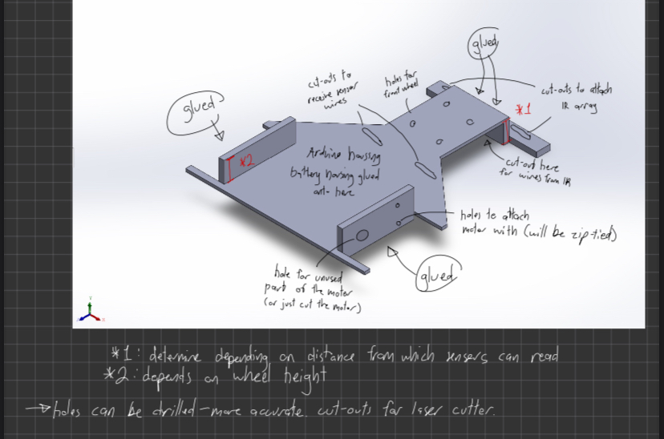

# LineFollowingCar
Group project with friends. Included in this repo is the Arduino code for our car. The car uses a [PID](https://en.wikipedia.org/wiki/Proportional%E2%80%93integral%E2%80%93derivative_controller) to follow a line. Inspiration taken from [DonnyCraft1's PIDArduino lib](https://github.com/DonnyCraft1/PIDArduino/tree/master).

## Demo

https://github.com/user-attachments/assets/74129656-9549-43fa-8a57-fd967698480c

## Parts List

- IR Infrared Obstacle Avoidance Sensor
- 5 Channel IR Sensor Array
- 2 TT Motors with Leads and Wheels (DC Motor 3-6V)
- L298N Motor Driver Controller
- 2 PCEONAMP 7.4V Li-ion Batteries (3000mAh)
- Swivel caster wheel
- Acrylic sheet
- lots of wires, twist nut caps, a switch, hotglue

## Chassis Design

